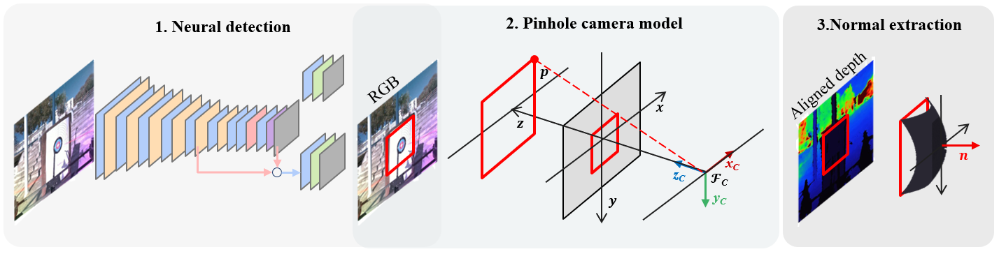

# Geometry-Informed Neural Network (GIN) Target Localization


This repository contains the code to detect circular target for "Target Localization and Manipulator Design for
Safe Aerial Physical Inspection Mission".

Aerial manipulators, which combine UAVs with robotic arms, are increasingly useful for tasks requiring surface detection and physical interaction. This paper introduces a novel system design for safe Aerial Physical Interaction (APhI) with defined surfaces. The system includes a UAV platform equipped with a 3-DoF lightweight robotic arm, an RGB-D camera for target detection, and sensors for precise localization. A Convolutional Neural Network (CNN) is used to detect targets, and the dataset is enhanced to improve accuracy. Outdoor experiments were conducted in various conditions, focusing on industrial settings to ensure reliable target detection and safe interactions.



## Structure of the repo

- [Configuration files of the neural network training and its architecture](cfg/README.md).
- [Container files](docker/README.md)
- [Launch files](launch/README.md)
- [ROS nodes](scr/README.md)
- [External libraries](lib/README.md)
- [Weights of the neurons of the network](weights/README.md)
- [Visualize data and images](visualization/README.md)
- [Docker files](docker/README.md)
- [Kubernetes configuration files](kubernetes/README.md)

## Setup

### Installation

The package has been developed in Ubuntu 20.04 with ROS Noetic. Support for other distro is not guarantee.

1. [Install ROS Noetic](https://wiki.ros.org/noetic/Installation)
2. Create a catking workspace

```bash
mkdir -p ~/catkin_ws/src
cd ~/catkin_ws
catkin init
```

3. Clone GIN

```bash
cd ~/catkin_ws
git clone git@github.com:Flying-Touchman/gin_target_localization.git
```

4. Install GIN dependencies ([rosdep](http://wiki.ros.org/rosdep))

```bash
cd ~/catkin_ws
rosdep install --from-paths src --ignore-src -r -y
cd ~/catkin_ws/src/gin_target_localization/docker
pip3 install -r requirements.txt 
```

5. Build GIN

```bash
catkin build -j4 gin
```

## Docker

To instead use docker
1. [Install docker](https://docs.docker.com/engine/install/ubuntu/), [nvidia-docker](https://docs.nvidia.com/datacenter/cloud-native/container-toolkit/latest/install-guide.html) and [docker compose](https://docs.docker.com/compose/)

2. Go inside docker folder

```bash
cd gin_target_localization/docker
```

3. Build docker image

```bash
docker compose build gin
```

4. Create docker container and launch it

```bash
docker compose up -d gin
```

5. Create a terminal inside docker container

```bash
docker exec -it gin_cnt zsh
```

## Launch GIN

Launch GIN

```bash
roslaunch gin target_detection.launch
```

### Sensor disclaimer

The GIN algorithm has been tested and validated with [Realsense Depth Camera D455](https://www.intelrealsense.com/depth-camera-d455/).\
However, the algorithm is designed to process data from different depth camera that publishes the following ROS topics:

- [camera info topic](http://docs.ros.org/en/noetic/api/sensor_msgs/html/msg/CameraInfo.html)
- [camera color topic](http://docs.ros.org/en/noetic/api/sensor_msgs/html/msg/Image.html)
- [camera depth topic](http://docs.ros.org/en/noetic/api/sensor_msgs/html/msg/Image.html)

## Run GIN with Dataset

Launch GIN with rosbag. Sample rosbag can be download [here](<link to the tunnel rosbag or DTU rosbag>)

```bash
roslaunch gin target_detection_rosbag.launch rosbag_path:=<example_bag_path.bag>
```